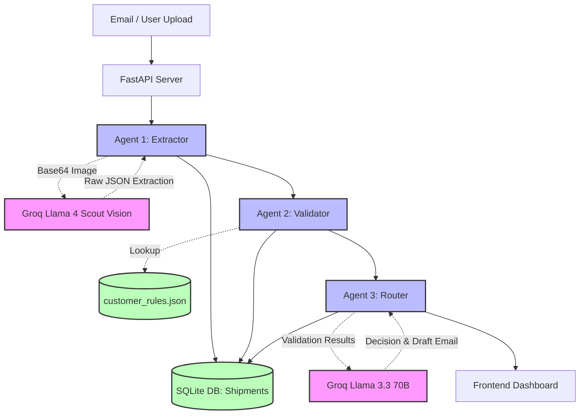

# Technical Write-Up: Nova Trade Document Pipeline

## 1. Architecture & Data Flow

Below is the architecture for the multi-agent pipeline. The system enforces a strict separation of concerns: extraction is purely visual, validation is deterministic, and routing is decision-based.



**State Management:** State does not live in memory between agent hops. Each agent independently persists its output to the SQLite database. If Agent 3 crashes due to a rate limit, the system can resume from the stored state of Agent 2 without reprocessing the image.

---

## 2. The 3 Nastiest Failure Modes

During testing, three critical failure modes emerged. Here is how they are handled:

**1. Vision Model Hallucination on Missing Fields (The "Ghost Data" Problem)**
* **The Failure:** Early in testing, if an Incoterm was missing from the PDF, the model would hallucinate "FOB" because it's statistically common in trade docs.
* **The Fix:** We implemented a two-part safeguard. First, prompt engineering: *"If a field is not visibly present, return null with confidence 0.0."* Second, the Validator automatically catches any `null` or confidence `< 0.7` and flags it as `UNCERTAIN`. Uncertain fields are mathematically prevented from being Auto-Approved, forcing human review.

**2. Upstream LLM Provider Rate Limits (HTTP 429)**
* **The Failure:** While presenting the demo, the Groq Llama 3.3 70B text model threw a 429 Resource Exhausted error because the free tier was temporarily overwhelmed globally.
* **The Fix:** The Router agent catches HTTP 429s and exceptions globally. Instead of crashing the server, it gracefully degrades: it defaults the decision to `flag_for_review`, sets the reasoning to the API error, and surfaces it to the UI. The human operator is alerted rather than blocked.

**3. Malformed JSON Extraction Responses**
* **The Failure:** The vision model would occasionally append markdown backticks (` ```json ... ``` `) or trailing commas, causing the `json.loads()` step to hard-crash.
* **The Fix:** We implemented strict string stripping logic before parsing, removing markdown blocks. If parsing still fails (e.g., structural corruption), the Extractor returns a specific `_error` payload, which triggers a `flag_for_review` downstream with the raw response attached for debugging.

---

## 3. Observability in Production

If this were running in production for 50 customers, we could not rely on print statements. We would implement distributed tracing (e.g., using **Langfuse** or **Datadog**).

**Tracing a single shipment:**
When an email arrives, a unique `TraceID` (UUID) is generated. This ID is passed in the headers to every agent and every database write. 
- **The Dashboard:** A production observability dashboard would show a Gantt chart of the `TraceID`. We would see exactly how many milliseconds the PDF-to-Image conversion took, the latency of the Extractor LLM call, the Validator execution time, and the Router LLM call. 
- **Visibility:** If a document is flagged, we can click the trace and see the exact prompt sent to the LLM and the raw token output, allowing us to debug if the prompt or the model degraded.

---

## 4. Cost Analysis

Using Groq's high-speed inference on Llama models provides incredibly low operational costs compared to traditional SaaS models.

* **Extractor (Llama 4 Scout Vision):** ~1,500 tokens for a standard 1-page PDF image + 500 prompt tokens. At ~$0.10 per 1M input tokens, this costs **$0.0002**.
* **Router (Llama 3.3 70B):** ~1,000 prompt tokens + 200 output tokens. At ~$0.50 per 1M tokens, this costs **$0.0006**.
* **Total Cost per Document:** **<$0.001** (Less than a tenth of a cent).

**Where it blows up:** 
If a supplier attaches a 100-page combined PDF where only page 4 is the Bill of Lading, converting 100 pages to base64 images and sending them to the vision model will blow up both cost and latency, and likely hit payload limits (e.g., Groq's 4MB base64 limit).
**How to control it:**
Implement a pre-processing step using a lightweight tool (like PyMuPDF text scraping or a tiny classifier) to identify which specific pages contain the required trade documents *before* sending them to the expensive vision model.

---

## 5. Latency 

* **The Slowest Hop:** The Extractor Agent. Sending a massive Base64 image payload over the wire and running vision inference takes 3-5 seconds. By comparison, the deterministic Validator takes <0.01 seconds, and the Text Router takes ~0.8 seconds.
* **How to fix it:**
  1. **Image Optimization:** Instead of high-res JPEGs, compress the PDF page to a lower DPI grayscale image. Trade docs are black-and-white text; they don't need color channels or high resolution.
  2. **Streaming:** Use streaming for the LLM responses so the UI can start rendering the JSON extraction field-by-field as it generates, reducing perceived latency to the user.

---

## 6. What I Would Do With a Week

If I had a week instead of a few days, I would build:

1. **Cross-Document Validation:** Currently, the system validates a single document against customer rules. Real trade shipments involve comparing the Bill of Lading *against* the Commercial Invoice (e.g., verifying the Total Weight matches across both). I would build a 4th agent for "Reconciliation".
2. **Human-in-the-Loop Feedback Engine:** When a human reviews a flagged document and corrects a field, that correction should be saved as a few-shot example. The next time the prompt is sent, it dynamically pulls that correction from a vector database (like Weaviate) to ensure the model doesn't make the same mistake twice.
3. **LangGraph Orchestration:** Currently, the pipeline is a hardcoded linear script (`E -> V -> R`). With a week, I would migrate this to **LangGraph**, allowing for complex routing topologies, such as looping back to the Extractor with an "Enhanced Prompt" if the initial confidence score is too low.
